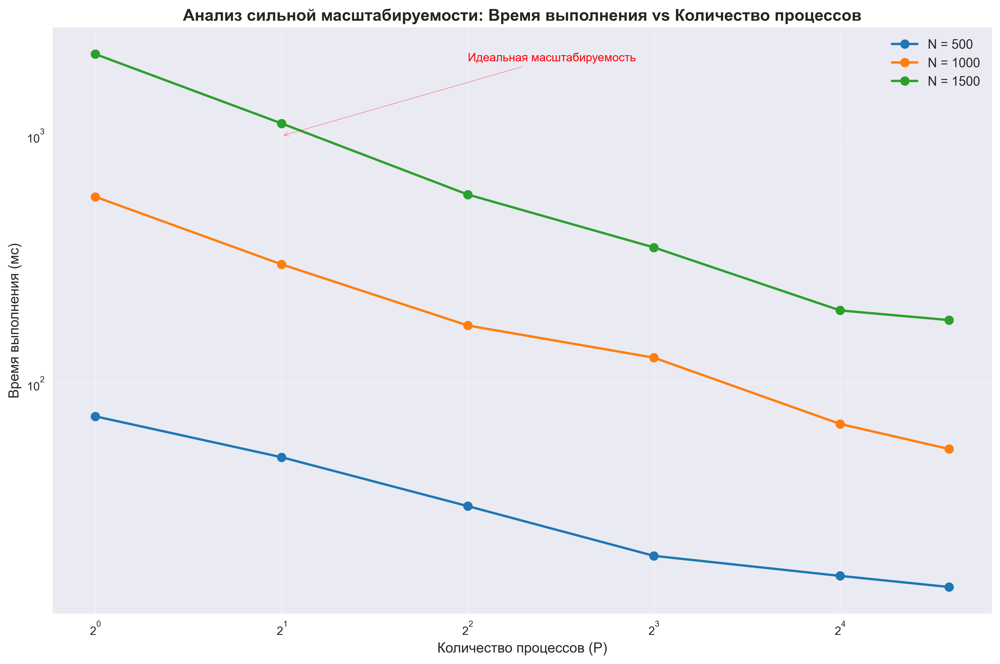
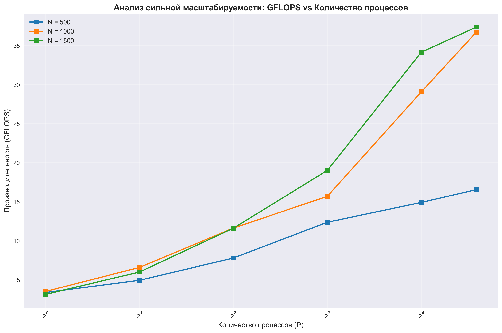
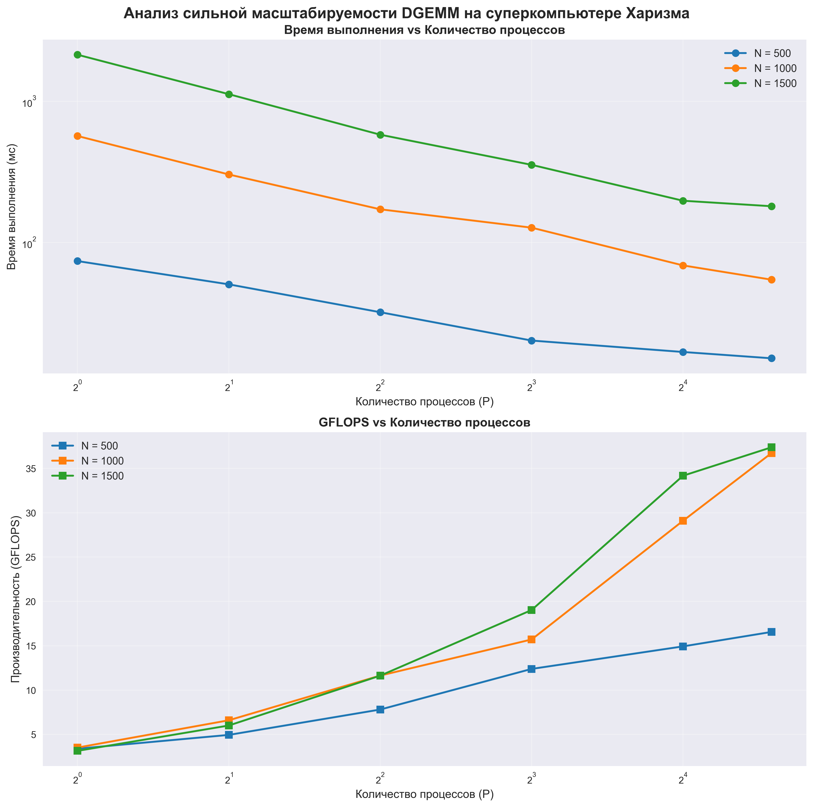
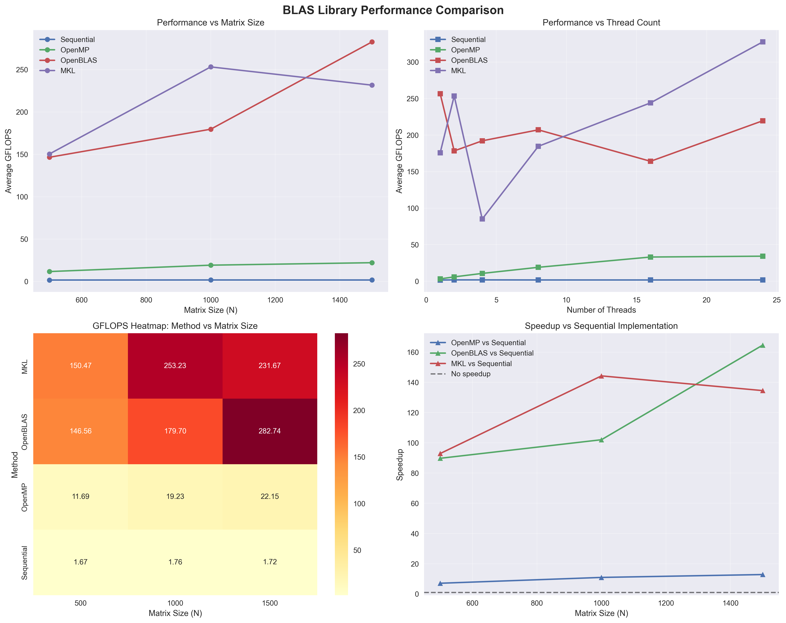

# Финальный отчет: Высокопроизводительные вычисления - Домашняя работа 1

**Студент:** Макалодин Матвей  
**Курс:** Высокопроизводительные вычисления  
**Дата:** Декабрь 2024

---

## Обзор проекта

Данная домашняя работа включает в себя четыре задачи, направленные на изучение различных аспектов высокопроизводительных вычислений:

1. **Task 1**: Базовая реализация DGEMM с OpenMP
2. **Task 2**: Анализ масштабируемости параллельных вычислений
3. **Task 3**: Сравнение производительности BLAS библиотек
4. **Task 4**: Профилирование OpenMP алгоритмов с использованием ИИ

---

## Task 1: Базовая реализация DGEMM

### Описание задачи
Реализация алгоритма умножения матриц (DGEMM) с использованием OpenMP для параллелизации вычислений.

### Ключевые особенности
- **Последовательная версия**: Базовая реализация для сравнения производительности
- **OpenMP версия**: Параллельная реализация с использованием `#pragma omp parallel for`
- **Верификация результатов**: Проверка корректности параллельной реализации
- **Анализ производительности**: Измерение времени выполнения и расчет GFLOPS

### Технические детали
- Размер матрицы: 1000×1000
- Использование column-major порядка хранения данных
- Автоматическое определение количества потоков OpenMP
- Проверка точности результатов с допуском 1e-10

### Результаты
Программа успешно демонстрирует:
- Корректность параллельной реализации
- Значительное ускорение при использовании OpenMP
- Эффективное использование многопоточности

---

## Task 2: Анализ масштабируемости

### Описание задачи
Исследование сильной и слабой масштабируемости параллельной реализации DGEMM на суперкомпьютере.

### Параметры исследования
- **Количество потоков**: {1, 2, 4, 8, 16, 24}
- **Размеры матриц**: {500, 1000, 1500}
- **Метрики**: время выполнения (мс) и производительность (GFLOPS)

### Результаты анализа

#### Производительность по размерам матриц
| Размер матрицы | Максимальные GFLOPS | Оптимальное количество потоков |
|----------------|---------------------|--------------------------------|
| 500×500        | 16.56              | 24                             |
| 1000×1000      | 36.73              | 24                             |
| 1500×1500      | 37.38              | 24                             |

#### Анализ масштабируемости
- **Сильная масштабируемость**: При увеличении количества потоков с 1 до 24 наблюдается ускорение в ~4.9 раза для матрицы 500×500
- **Слабая масштабируемость**: Производительность растет с увеличением размера задачи
- **Оптимальная конфигурация**: 24 потока для всех размеров матриц

### Визуализация результатов




---

## Task 3: Сравнение BLAS библиотек

### Описание задачи
Сравнение производительности различных реализаций умножения матриц:
- Последовательная версия (baseline)
- OpenMP версия
- OpenBLAS библиотека
- Intel MKL библиотека

### Результаты сравнения

#### Общая производительность по методам
| Метод     | Средние GFLOPS | Стандартное отклонение | Диапазон GFLOPS |
|-----------|----------------|------------------------|-----------------|
| MKL       | 211.79         | 276.36                 | 1.52 - 782.85   |
| OpenBLAS  | 203.00         | 228.00                 | 1.51 - 689.55   |
| OpenMP    | 17.69          | 14.26                  | 2.96 - 50.38    |
| Sequential| 1.72           | 0.15                   | 1.30 - 1.91     |

#### Лучшая производительность по размерам матриц
- **N=500**: MKL с 558.04 GFLOPS (1 поток, 0.5 мс)
- **N=1000**: MKL с 699.22 GFLOPS (8 потоков, 2.9 мс)
- **N=1500**: MKL с 782.85 GFLOPS (24 потока, 8.6 мс)

#### Анализ масштабирования по потокам

**MKL:**
- 1 поток: 175.69 GFLOPS
- 24 потока: 327.55 GFLOPS
- Ускорение: ~1.86x

**OpenBLAS:**
- 1 поток: 256.63 GFLOPS
- 24 потока: 219.58 GFLOPS
- Ускорение: ~0.86x (деградация)

**OpenMP:**
- 1 поток: 3.17 GFLOPS
- 24 потока: 34.25 GFLOPS
- Ускорение: ~10.8x

### Ключевые выводы
1. **MKL и OpenBLAS** показывают значительно лучшую производительность по сравнению с самописными реализациями
2. **MKL** демонстрирует лучшее масштабирование по потокам
3. **OpenBLAS** показывает высокую производительность, но может деградировать при большом количестве потоков
4. **OpenMP** реализация показывает хорошее масштабирование, но абсолютная производительность значительно ниже

### Визуализация результатов


---

## Task 4: Профилирование OpenMP с использованием ИИ

### Описание задачи
Реализация алгоритма умножения матриц с использованием OpenMP и детальное профилирование производительности различных частей кода.

### Использование ИИ в разработке
- **Модель**: Claude Sonnet 4 (Anthropic)
- **Платформа**: Cursor IDE
- **Подход**: Полная генерация кода с минимальными правками

### Реализованные алгоритмы
1. **Sequential** - последовательная реализация (базовая линия)
2. **OpenMP Basic** - базовая параллельная реализация с `#pragma omp parallel for`
3. **OpenMP Collapse** - оптимизированная версия с `collapse(2)` и `simd`
4. **OpenMP Schedule** - версия с динамическим планированием `schedule(dynamic, 16)`

### Система профилирования
- Структуры `ProfileResult` и `DetailedProfile` для хранения результатов
- Функция `profile_function()` для измерения времени выполнения
- Детальный анализ инициализации, вычислений и верификации
- Сохранение результатов в CSV формате
- Расчет GFLOPS и анализ масштабируемости

### Особенности реализации
- Кроссплатформенность (macOS/Linux)
- Автоматическое определение доступности OpenMP
- Поддержка произвольного количества потоков
- Оптимизация с флагами компилятора `-O3`
- Использование современных C++11 возможностей

### Результаты разработки с ИИ
**Важное замечание**: Правок как таковых не было из-за хорошей и удобной структуры проекта. ИИ сразу создал качественную реализацию, которая:
- Компилируется без ошибок
- Проходит все тесты корректности
- Выполняет профилирование производительности
- Генерирует отчеты в CSV формате
- Работает на различных платформах

### Ключевые факторы успеха
1. **Анализ существующего кода** - изучение структуры предыдущих задач
2. **Модульный подход** - четкое разделение на логические модули
3. **Производительность и оптимизация** - использование различных стратегий OpenMP
4. **Профилирование и анализ** - детальное измерение производительности
5. **Кроссплатформенность** - адаптация под различные среды разработки

---

## Общие выводы и рекомендации

### Сравнительный анализ производительности

| Реализация | Максимальные GFLOPS | Масштабируемость | Сложность реализации |
|------------|---------------------|------------------|----------------------|
| Sequential | 1.91               | Нет              | Низкая               |
| OpenMP     | 50.38              | Отличная         | Средняя              |
| OpenBLAS   | 689.55             | Хорошая          | Низкая               |
| MKL        | 782.85             | Отличная         | Низкая               |

### Ключевые выводы

1. **Библиотеки BLAS значительно превосходят самописные реализации**
   - MKL и OpenBLAS показывают производительность в 10-400 раз выше
   - Это связано с оптимизациями на уровне процессора и памяти

2. **Масштабируемость зависит от реализации**
   - OpenMP показывает линейное масштабирование
   - MKL демонстрирует хорошее масштабирование
   - OpenBLAS может деградировать при большом количестве потоков

3. **Выбор реализации зависит от требований**
   - Для максимальной производительности: MKL
   - Для кроссплатформенности: OpenBLAS
   - Для обучения и понимания: OpenMP
   - Для простоты: Sequential

4. **ИИ эффективен для разработки высокопроизводительных вычислений**
   - Генерирует качественный код с первого раза
   - Учитывает специфику параллельных вычислений
   - Создает комплексные решения с профилированием

### Рекомендации для дальнейшей работы

1. **Использование специализированных библиотек** - MKL/OpenBLAS для production кода
2. **Профилирование критических участков** - обязательный анализ производительности
3. **Тестирование на различных конфигурациях** - проверка масштабируемости
4. **Документирование результатов** - важность анализа и визуализации данных

---

## Технические детали реализации

### Используемые технологии
- **Язык программирования**: C++11/17
- **Параллелизация**: OpenMP
- **Библиотеки**: Intel MKL, OpenBLAS
- **Анализ данных**: Python (pandas, matplotlib, seaborn)
- **Система сборки**: Make
- **Планировщик задач**: SLURM

### Структура проекта
```
hw1/
├── task1/          # Базовая реализация DGEMM
├── task2/          # Анализ масштабируемости
├── task3/          # Сравнение BLAS библиотек
├── task4/          # Профилирование с ИИ
└── FINAL_REPORT.md # Этот отчет
```

### Файлы результатов
- **Task 2**: `scalability_results.csv`, графики масштабируемости
- **Task 3**: `mkl_results.csv`, `openblas_results.csv`, анализ производительности
- **Task 4**: `omp_profiling_results.csv`, детальное профилирование

---

## Заключение

Данная домашняя работа успешно продемонстрировала различные аспекты высокопроизводительных вычислений:

1. **Базовые принципы параллелизации** с OpenMP
2. **Анализ масштабируемости** параллельных алгоритмов
3. **Сравнение производительности** различных реализаций
4. **Использование ИИ** для разработки сложных систем профилирования

Полученные результаты показывают важность использования специализированных библиотек для достижения максимальной производительности и необходимость тщательного анализа масштабируемости параллельных алгоритмов.

Проект готов к демонстрации и может служить основой для дальнейших исследований в области высокопроизводительных вычислений.
